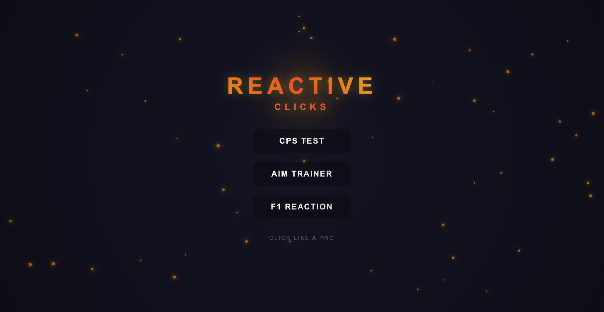
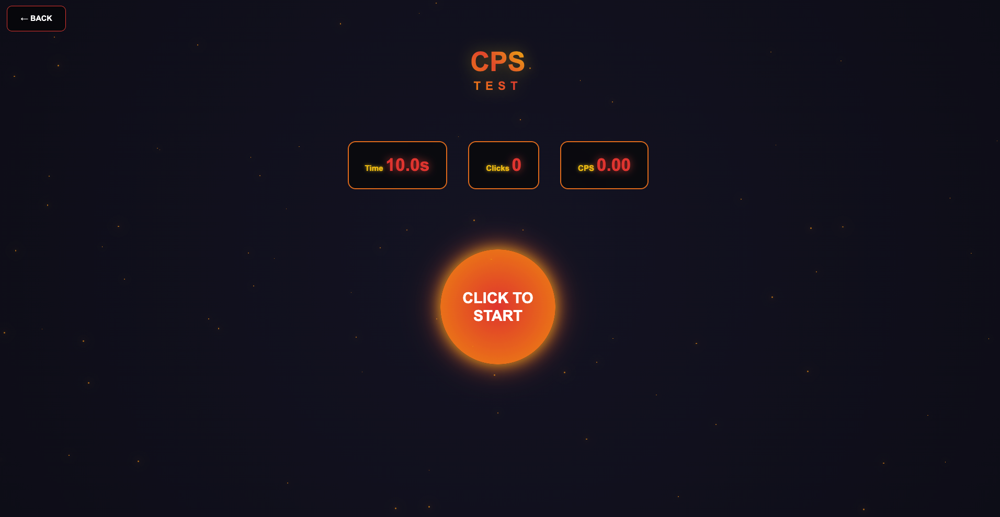
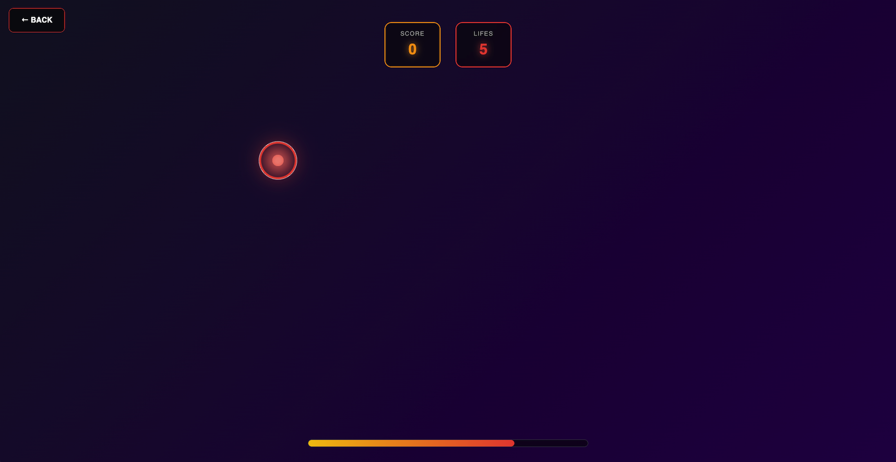
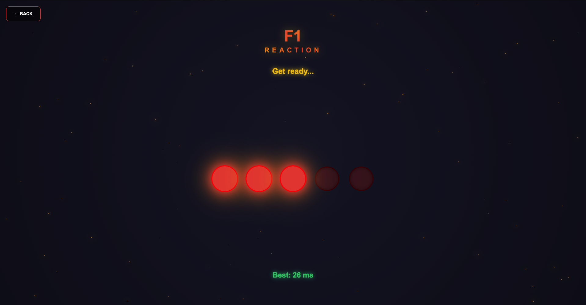

# Reactive Clicks

**Reactive Clicks** is a fast-paced browser game built with **SvelteKit** and **Vite**.  
It features **three** high-energy mini-games - **CPS Test**, **Aim Trainer**, and **F1 Reaction Timer** - all powered by smooth animations, neon visuals, and instant feedback.

---

## Features

- **CPS Test** – Click as fast as possible in 10 seconds  
- **Aim Trainer** – Hit moving targets before they disappear (5 misses = game over)  
- **F1 Reaction Timer** – React the moment the lights go out, just like an F1 start  
- Explosive particle effects on hits  
- Dynamic neon glows and animated borders  
- Real-time intensity-based background transitions  
- Fully responsive 
- Sci-fi UI with **Orbitron** font and cyberpunk vibes  

---

## Tech Stack

| Technology     | Purpose                     |
|----------------|-----------------------------|
| **SvelteKit**  | Frontend framework & routing |
| **Vite**       | Lightning-fast dev server & build |
| **Svelte**     | Reactive UI components      |
| **JavaScript** | Game logic & interactivity  |
| **CSS**        | Animations, gradients, effects |
| **Orbitron**   | Futuristic typography       |

## Screenshots

### Main Menu
A clean and animated start screen where players can choose between different game modes.

### CPS Test
Test how fast you can click in 10 seconds — smooth animations, particle feedback, and score tracking.

### Aim Trainer
Click on the targets as quickly and accurately as possible — you have only 1 second before they disappear. Miss 5, and it’s game over.  

### Reaction Timer
Inspired by F1 lights — wait for the lights to turn off, then click as fast as you can!

## How to run

### Clone the repository
git clone https://github.com/d1ogogomes/reactiveclicks.git
cd reactiveclicks

### Install dependencies
npm install

### Start the development server
npm run dev

### (Optional) Build for production
npm run build && npm run preview

